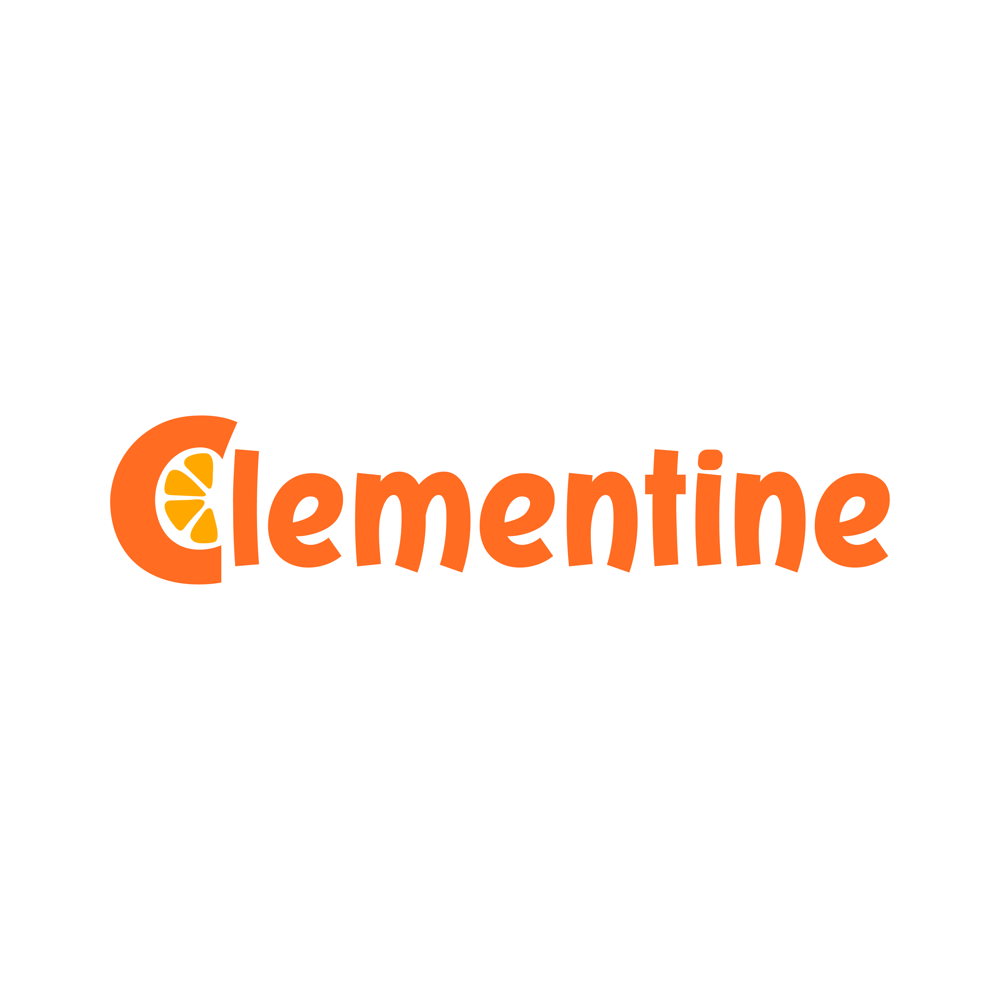

# PropuestaPsicoElia - Plataforma Digital Integral

## 1. Resumen Ejecutivo

Desarrollo de una plataforma web integral para PsicoElia que incluye:
- Landing page editable con CMS
- Sistema de pagos integrado
- Agendamiento de citas online
- Dashboard administrativo completo

## 2. Componentes del Sistema

### 2.1 Landing Page con CMS
- **Editor Visual**: Sistema que permite editar directamente desde la página
- **Gestión de Contenido**: Secciones modulares editables
- **SEO**: Optimización automática y configurable

### 2.2 Sistema de Pagos
- **Pasarelas**: Integración con Stripe y MercadoPago
- **Recurrencia**: Suscripciones y pagos únicos
- **Facturación**: Generación automática de recibos

### 2.3 Sistema de Agendamiento
- **Calendario**: Integración con Google Calendar
- **Disponibilidad**: Configuración de horarios disponibles
- **Confirmaciones**: Emails automáticos y recordatorios

### 2.4 Dashboard Administrativo
- **Gestión de Citas**: CRUD completo de citas
- **Reportes**: Métricas de ventas y citas
- **Usuarios**: Gestión de pacientes
- **Contenido**: Edición del CMS desde admin

## 3. CMS con Edición In-Site

**Sí, es posible permitir la edición directa desde la página:**

### Opciones Técnicas:
1. **Sistema Custom**: Editor modal que se activa sobre la página
2. **Sanity + Live Preview**: Visual editing con preview en tiempo real
3. **Payload CMS**: Editor contextual integrado

### Ventajas:
- UX superior para el cliente
- Edición contextual
- Preview inmediato
- No necesidad de panel separado

## 4. Stack Tecnológico Propuesto

- **Frontend**: Next.js 14 con TypeScript
- **CMS**: Sanity CMS o Payload CMS
- **Pagos**: Stripe / MercadoPago
- **Base de Datos**: PostgreSQL
- **Hosting**: Vercel / AWS

## 5. Fases de Desarrollo

1. **Infraestructura Base** (2-3 semanas)
2. **Landing Page + CMS** (3-4 semanas)
3. **Sistema de Pagos** (2-3 semanas)
4. **Agendamiento** (3-4 semanas)
5. **Dashboard Admin** (2-3 semanas)
6. **Testing y Deploy** (1-2 semanas)

---

*Propuesta desarrollada por Clementine Creativo para PsicoElia*
