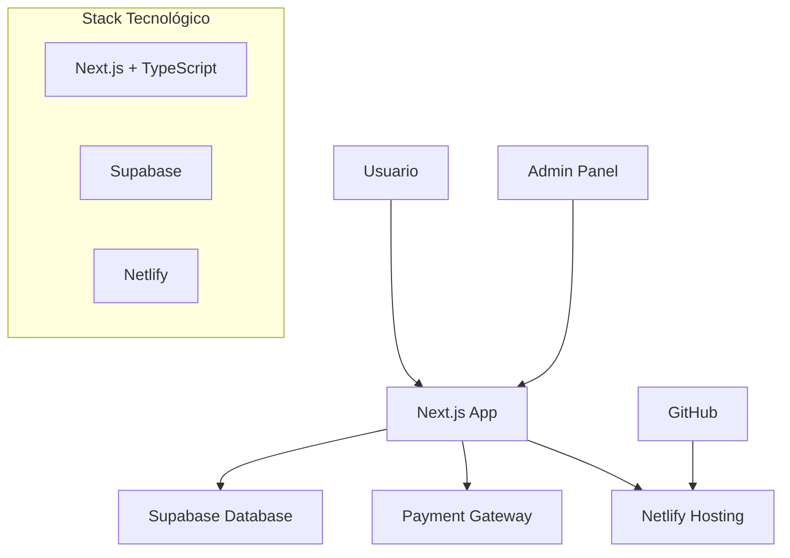
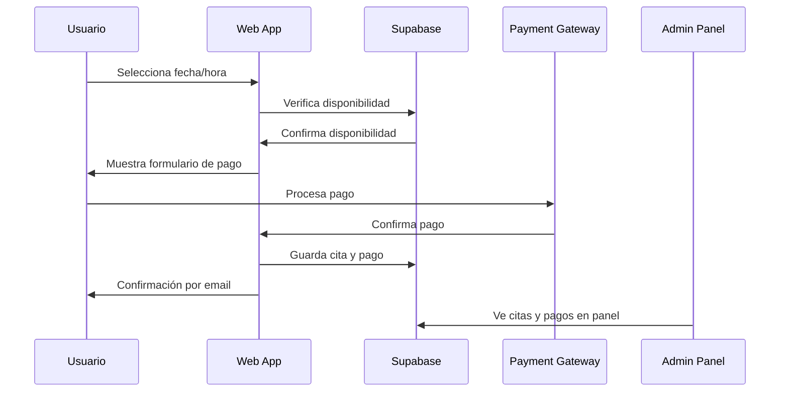

# PropuestaPsicoElia - Plataforma Digital Integral

## 1. Resumen Ejecutivo

Desarrollo de una plataforma web integral para PsicoElia que incluye:

- Página de aterrizaje profesional
- Sistema de pagos integrado
- Agendamiento de citas en línea
- Panel administrativo completo

## 2. Componentes del Sistema

### 2.1 Página de Aterrizaje

- **Diseño Profesional**: Diseño moderno y adaptable a dispositivos
- **Información de Servicios**: Presentación clara de servicios psicológicos
- **SEO**: Optimización para motores de búsqueda

### 2.2 Sistema de Pagos

- **Pasarelas**: Integración con Stripe y MercadoPago
- **Recurrencia**: Suscripciones y pagos únicos
- **Facturación**: Generación automática de recibos

### 2.3 Sistema de Agendamiento

- **Base de Datos Propia**: Gestión completa desde Supabase
- **Disponibilidad**: Configuración de días y horarios desde panel administrativo
- **Confirmaciones**: Correos automáticos y recordatorios

### 2.4 Panel Administrativo

- **Acceso Exclusivo**: Solo disponible para la propietaria (PsicoElia)
- **Gestión de Citas**: Visualización y administración completa
- **Control de Disponibilidad**: Configuración de días y horarios disponibles
- **Pagos**: Visualización de pagos recibidos y confirmados
- **Reportes**: Montos semanales y mensuales
- **Promociones**: Editor de texto para descuentos y ofertas
- **Usuarios**: Gestión de pacientes
- **Extensibilidad**: Funcionalidad ampliable según necesidades futuras

## 3. Tecnologías Propuestas

- **Frontend**: Next.js 14 con TypeScript
- **Base de Datos**: Supabase
- **ORM**: Supabase SDK nativo (no requiere Prisma)
- **Testing**: Jest + React Testing Library + Playwright
- **Alojamiento**: Netlify (gratuito)
- **Control de Versiones**: GitHub
- **Renderizado**: SSR y SSG para optimización SEO
- **Autenticación**: JWT
- **Seguridad**: Server Actions de Next.js

### Nota sobre ORM:

Supabase incluye su propio SDK con TypeScript que facilita las consultas a la base de datos sin necesidad de Prisma, reduciendo la complejidad del proyecto y manteniendo la simplicidad del stack.

## 4. Opciones de Pago Integradas

### Plataformas Recomendadas:

#### **MercadoPago** (Más Accesible)

- **Comisiones Colombia**:
  - Inmediato: 3.29% + $800 COP + IVA
  - 14 días: 2.79% + $800 COP + IVA
  - 30 días: Menor comisión disponible
- Simulador de comisiones disponible
- Ideal para mercado latinoamericano

#### **WePay.co**

- Información de comisiones disponible contactando directamente
- Especializado en Colombia

#### **Otras Opciones**:

- **PayU Latam**: Mínimo $9,900 COP + IVA por transacción
- **Stripe**: Solución internacional
- **PayPal**: Integración adicional disponible
- **Nequi**: Solo reportes (requiere verificación con representantes)

### Consideraciones:

- Wise: No disponible para pagos con tarjeta
- CMS: Incrementaría costos y tiempo de desarrollo
- WordPress + WooCommerce: No recomendado por dependencia de plataforma

## 5. Arquitectura del Sistema

## 6. Flujo de Agendamiento

## 7. Tiempo de Desarrollo

**6 semanas** posterior a la entrega del diseño gráfico aprobado

### Metodología de Desarrollo:

- **Desarrollo convencional**: Código primero, tests después
- **Cobertura de pruebas**: Mínimo 80% del código
- **CI/CD**: Tests automáticos en cada commit y deploy

## 8. Contenido y SEO

- **Páginas Principales**: Landing con secciones solicitadas
- **Páginas Adicionales**: Información complementaria estática
- **Editor de Promociones**: Desde panel administrativo
- **Optimización SEO**: SSR y SSG (recomendado para motores de búsqueda)

## 9. Testing y Calidad del Código

### Suite de Testing Implementada:

- **Jest**: Framework de testing principal
- **React Testing Library**: Testing de componentes React
- **Playwright**: Tests end-to-end automatizados
- **Supertest**: Testing de APIs y endpoints

### Tipos de Pruebas Incluidas:

#### **Unit Tests** (Jest + RTL)

- Componentes de agendamiento
- Funciones de validación
- Utilidades de formato (fechas, precios)
- Hooks personalizados

#### **Integration Tests**

- Flujo completo: Agendar → Pagar → Confirmar
- Integración con Supabase
- Webhooks de payment gateways
- Generación de enlaces Meet

#### **End-to-End Tests** (Playwright)

- Experiencia completa del usuario
- Navegación entre páginas
- Proceso de pago completo
- Responsive design en múltiples dispositivos

#### **API Tests**

- Endpoints de agendamiento
- Validación de pagos
- Integración Google Meet API
- Manejo de errores

### Métricas de Calidad:

- **Cobertura de código**: Mínimo 80%
- **Performance**: Lighthouse score >90
- **Accessibility**: WCAG 2.1 AA compliance
- **SEO**: Lighthouse SEO score >95

### CI/CD Pipeline:

## 10. Soporte Post-Lanzamiento

- **30 días continuos**: Correcciones y mejoras incluidas
- **Post 30 días**: Tarifa por hora para modificaciones
- **Monitoreo incluido**: Error tracking y performance monitoring

## 10. Seguridad y Escalabilidad

### Opción Estándar:

- Server Actions de Next.js
- JWT para autenticación
- Tokens según plataforma de pago

### Opción Avanzada (si se requiere):

- Servidor Express.js o Ruby on Rails
- **Costo adicional**: $18-$24 USD mensuales para hosting especializado

## 11. Presupuesto

**Total: $260 USD**

| Concepto                                     | Precio       |
| -------------------------------------------- | ------------ |
| Diseño Web                                   | $50 USD      |
| Desarrollo, Integración de APIs y Despliegue | $170 USD     |
| Dominio por Dos Años                         | $40 USD      |
| **TOTAL**                                    | **$260 USD** |

### Forma de Pago:

- **70% al inicio**: $182 USD (incluye dominio)
- **30% al finalizar**: $78 USD

## 12. Requerimientos del Cliente

### Accesos Necesarios:

- **Correo electrónico** para crear cuentas en:
  - Netlify
  - Supabase
  - Namecheap

### Materiales Requeridos:

- Diseño gráfico de la web
- Paleta de colores
- Fotografías
- Logo en formato PNG
- **Dominio**: psicoelia.com

### Información Profesional y de Servicios Requerida:

#### **A. Catálogo de Servicios**

**Definir para cada servicio:**

- [ ] Terapia Individual (duración, modalidad, precio)
- [ ] Terapia de Pareja (duración, modalidad, precio)
- [ ] Terapia Familiar (duración, modalidad, precio)
- [ ] Psicoterapia Online (plataforma, duración, precio)
- [ ] Evaluaciones Psicológicas (tipo, duración, precio)
- [ ] Talleres Grupales (temática, duración, precio)
- [ ] **Modalidades**: Presencial / Online / Híbrida
- [ ] **Especialidades**: Ansiedad, Depresión, Trauma, etc.

#### **B. Estructura de Precios**

- [ ] **Precio por sesión individual**: $XXX COP
- [ ] **Precio terapia de pareja**: $XXX COP
- [ ] **Paquetes con descuento**: 4 sesiones, 8 sesiones
- [ ] **Descuento por pago anticipado**: X%
- [ ] **Política de precios especiales**: Estudiantes, tercera edad
- [ ] **Moneda de manejo**: COP / USD
- [ ] **Métodos de pago aceptados**: Definir preferencia

#### **C. Políticas de Agendamiento**

- [ ] **Horarios de atención**: Días y horas disponibles
- [ ] **Duración estándar de sesión**: 45 min / 60 min / 90 min
- [ ] **Tiempo mínimo para agendar**: 24h / 48h / 72h
- [ ] **Política de cancelación**: Tiempo mínimo sin penalización
- [ ] **Política de reprogramación**: Condiciones y límites
- [ ] **No-show policy**: Qué sucede si no se presenta
- [ ] **Tiempo entre citas**: Margen para preparación
- [ ] **Recordatorios**: 24h antes / 2h antes / ambos
- [ ] **Máximo de citas por día**: Límite de capacidad

#### **D. Información Profesional**

- [ ] **Biografía completa**: Formación académica, experiencia
- [ ] **Certificaciones**: Títulos, especializaciones, membresías
- [ ] **Años de experiencia**: En práctica clínica
- [ ] **Enfoque terapéutico**: Cognitivo-conductual, humanista, etc.
- [ ] **Número de licencia profesional**: Registro ante autoridades
- [ ] **Áreas de especialización**: Poblaciones o trastornos específicos
- [ ] **Testimonios**: De pacientes anteriores (con consentimiento)
- [ ] **Fotografía profesional**: Para la página web

#### **E. Aspectos Legales y Éticos**

**Documentos Legales de la Plataforma Web:**

- [ ] **Términos y Condiciones del Sitio Web**:

  - Uso de la plataforma de agendamiento
  - Responsabilidades del usuario y la plataforma
  - Limitaciones de responsabilidad técnica
  - Política de cookies y seguimiento
  - Derechos de propiedad intelectual
  - Modificaciones a los términos
  - Ley aplicable y jurisdicción

- [ ] **Política de Privacidad de la Web**:
  - Qué datos se recolectan (navegación, cookies, formularios)
  - Cómo se utilizan los datos técnicos
  - Compartir información con terceros (pasarelas de pago)
  - Derechos del usuario (acceso, rectificación, eliminación)
  - Seguridad de los datos técnicos
  - Transferencias internacionales de datos
  - Contacto para temas de privacidad

**Documentos Legales del Servicio Psicológico:**

- [ ] **Términos y Condiciones del Servicio Psicológico**:

  - Naturaleza de los servicios psicológicos ofrecidos
  - Límites y alcance de la terapia online vs presencial
  - Responsabilidades del paciente y del terapeuta
  - Política de cancelaciones y reembolsos
  - Procedimientos en caso de emergencias psicológicas
  - Limitaciones del servicio
  - Requisitos de edad y consentimiento parental
  - Política de no discriminación

- [ ] **Política de Privacidad del Servicio Psicológico**:
  - Confidencialidad terapéutica y secreto profesional
  - Excepciones a la confidencialidad (riesgo, menores)
  - Almacenamiento seguro de información sensible
  - Tiempo de conservación de registros clínicos
  - Acceso a la información por parte del paciente

**Consentimientos y Autorizaciones:**

- [ ] **Consentimiento Informado Digital**: Formato válido legalmente
- [ ] **Autorización para Teleconsulta**: Específico para terapia online
- [ ] **Consentimiento para Menores**: Autorización parental requerida
- [ ] **Autorización de Grabación** (si aplica): Para fines terapéuticos

**Integración con Herramientas Externas:**

- [ ] **Google Meet**: Configuración para generar enlaces automáticos de videollamada
- [ ] **Calendly**: Opción alternativa para sistema de agendamiento
- [ ] **Sincronización de calendarios**: Google Calendar integrado con las citas

**Políticas Operativas Simplificadas:**

- [ ] **Política de cancelación**: Tiempo límite sin penalización
- [ ] **Política de reembolsos**: Condiciones y excepciones
- [ ] **Comunicación entre sesiones**: Límites y canales permitidos
- [ ] **Procedimiento de quejas**: Cómo manejar inconformidades

#### **F. Formularios de Admisión**

- [ ] **Datos demográficos básicos**: Nombre, edad, contacto
- [ ] **Motivo de consulta**: Razón principal
- [ ] **Historial médico relevante**: Medicamentos, condiciones
- [ ] **Historial psicológico previo**: Terapias anteriores
- [ ] **Información de emergencia**: Contacto de familiar
- [ ] **Preferencias de comunicación**: Email, WhatsApp, llamada
- [ ] **Disponibilidad horaria**: Horarios preferidos del paciente

#### **G. Comunicación y Seguimiento**

- [ ] **Canal principal de comunicación**: WhatsApp, Email, Sistema interno
- [ ] **Protocolo de comunicación entre sesiones**: Límites y disponibilidad
- [ ] **Formato de confirmación de citas**: Automático por email/SMS
- [ ] **Proceso de reagendamiento**: Pasos y plataformas
- [ ] **Manejo de cancelaciones**: Notificación y procedimiento

#### **H. Aspectos Técnicos Específicos**

**Opciones de Sistema de Agendamiento:**

- [ ] **Sistema Propio**: Desarrollado en la plataforma con Supabase
- [ ] **Calendly Integration**: Como alternativa más robusta de agendamiento
- [ ] **Híbrido**: Combinación de ambos sistemas

**Generación de Videollamadas:**

- [ ] **Google Meet REST API**: Creación automática de espacios de reunión
- [ ] **Configuración requerida**:
  - Google Cloud Platform account
  - Service Account con Meet API enabled
  - OAuth2 authentication setup
- [ ] **Funcionalidad**:
  - Generación de meeting codes únicos (abc-mnop-xyz)
  - Links permanentes (válidos 365 días sin uso)
  - Envío automático por email al confirmar pago

**Sincronización de Calendarios:**

- [ ] **Google Calendar**: Integración bidireccional
- [ ] **Notificaciones**: Recordatorios automáticos
- [ ] **Bloqueo de horarios**: Prevenir doble agendamiento

**Testing y Calidad:**

- [ ] **Suite de Testing**: Jest + React Testing Library + Playwright
- [ ] **Tipos de pruebas requeridas**:
  - Unit Tests: Componentes individuales
  - Integration Tests: Flujos de agendamiento y pago
  - End-to-End Tests: Experiencia completa del usuario
  - API Tests: Endpoints de Supabase y servicios externos
- [ ] **Cobertura mínima**: 80% del código
- [ ] **CI/CD Pipeline**: Tests automáticos en GitHub Actions

**Aspectos Técnicos Generales:**

- [ ] **Backup de información**: Política de respaldo de datos
- [ ] **Acceso desde dispositivos móviles**: Requerimientos de compatibilidad
- [ ] **Seguridad de enlaces**: Expiración de links de Meet
- [ ] **Performance Testing**: Lighthouse scores mínimos
- [ ] **Accessibility Testing**: WCAG 2.1 compliance

### Validación Legal Simplificada:

**Antes del lanzamiento se debe validar:**

- ✅ Términos y condiciones web (uso de plataforma)
- ✅ Política de privacidad web (datos de navegación y pagos)
- ✅ Cumplimiento básico con protección de datos Colombia
- ✅ Consentimientos para servicios digitales

## 13. Contacto

**Miguel Figuera**

- Email: miguelqui725@gmail.com
- Teléfono: +58 424 172 7988

---

_Propuesta desarrollada por Clementine Creativo para PsicoElia_
